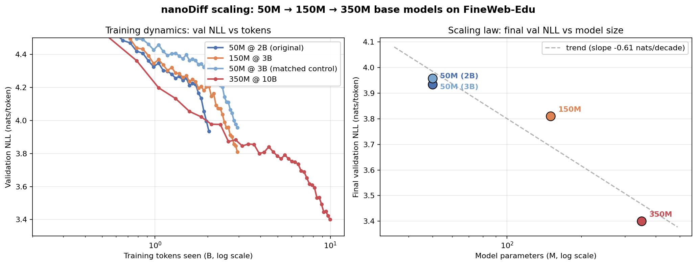

# nanoDiff

A minimal, clean, hackable implementation of a **state-of-the-art diffusion
language model**, built to *learn, understand, train, and improve* dLLMs.

Think of it as [nanoGPT](https://github.com/karpathy/nanoGPT) / nanochat, but for
**diffusion** language models instead of autoregressive ones. It distills the
**LLaDA** recipe (the simplest formulation that has scaled to 8B–100B) down to a
small modular package you can read in an afternoon.

> Based on **LLaDA: Large Language Diffusion Models**
> ([Nie et al. 2025, arXiv:2502.09992](https://arxiv.org/abs/2502.09992)). The
> broader lineage (D3PM → LLaDA 2.0) is in [References](#references).

---

## How it works

A masked diffusion LM denoises text instead of writing it left-to-right.

- **Forward process** ([`diffusion.py`](nanodiff/diffusion.py)): sample `t ~ U(0,1)`, replace each token with `[MASK]` independently with probability `t`. No Gaussians, no latents.
- **Model** ([`model.py`](nanodiff/model.py)): LLaMA-style transformer (RMSNorm, SwiGLU, RoPE) with **bidirectional** attention. The only architectural change from a GPT.
- **Loss** ([`diffusion.py`](nanodiff/diffusion.py)): `1/t`-weighted cross-entropy on masked positions only. The weight makes it a real NLL upper bound, not a heuristic.
- **Sampling** ([`sampler.py`](nanodiff/sampler.py)): start fully masked, predict every position, commit the most confident, re-mask the rest, iterate. See [docs/sampling.md](docs/sampling.md) for the full algorithm.

```
        t=1  ████████████████████   (all [MASK])
             ██ the ███ of ████ is
             ██ the meaning of life is
        t=0  the meaning of life is   (clean text)
                ▲ each step: predict, commit confident, repeat
```

**Why bother:** parallel generation, bidirectional context, native infilling, tunable quality↔speed dial.

---

## Quickstart

```bash
uv sync                       # create .venv, install deps + the nanodiff package
source .venv/bin/activate     # (or prefix the commands below with `uv run`)
python tests/smoke_test.py    # optional: verify the core stack works (~2 min, CPU)

# 1. tokenize a pretraining corpus (downloads FineWeb-Edu, then tokenizes)
python scripts/prepare_data.py --out-dir data/fineweb_edu --num-tokens 2_000_000_000

# 2. pretrain a base model (single GPU)
python pretrain/train.py --config pretrain/configs/50m.py
#    ...or multi-GPU:
torchrun --standalone --nproc_per_node=8 pretrain/train.py --config pretrain/configs/50m.py

# 3. sample / evaluate
python sample.py --ckpt checkpoints/50m/ckpt.pt --prompt "The meaning of life is"
python eval.py --ckpt checkpoints/50m/ckpt.pt --iters 500

# 4. (optional) instruction-tune the base on Alpaca-cleaned
python scripts/prepare_sft_data.py --out-dir data/alpaca_sft
python sft/train.py --config sft/configs/50m_alpaca.py
```

### Scaling

Scaling is a one-file change: copy a config and edit the model/optimizer fields.

```python
# pretrain/configs/350m.py
from nanodiff.config import Config
config = Config(name="nanodiff-350m", n_layer=16, n_embd=1280, n_head=20,
                batch_size=16, grad_accum_steps=16, out_dir="checkpoints/350m")
```

Everything reads from the `Config` dataclass, so model code never changes.

---

## Pretrained models

Six pretrained checkpoints are on the Hugging Face Hub:

| Model | What it is |
|---|---|
| [Sebasdi/nanodiff-50m-base](https://huggingface.co/Sebasdi/nanodiff-50m-base) | the 50M base, pretrained on ~2B tokens of FineWeb-Edu (val perplexity ~50) |
| [Sebasdi/nanodiff-150m-base](https://huggingface.co/Sebasdi/nanodiff-150m-base) | the 150M base, pretrained on ~3B tokens of FineWeb-Edu (val perplexity ~44) |
| [Sebasdi/nanodiff-350m-base](https://huggingface.co/Sebasdi/nanodiff-350m-base) | the 350M base, pretrained on ~10B tokens of FineWeb-Edu (val perplexity ~29, LAMBADA 36.95%) |
| [Sebasdi/nanodiff-50m-sft-alpaca](https://huggingface.co/Sebasdi/nanodiff-50m-sft-alpaca) | the 50M base, instruction-tuned on Alpaca-cleaned (~51k examples) |
| [Sebasdi/nanodiff-150m-sft-alpaca](https://huggingface.co/Sebasdi/nanodiff-150m-sft-alpaca) | the 150M base, instruction-tuned on Alpaca-cleaned: meaningfully better than the 50M SFT (LAMBADA 15.74% vs 14.32%) |
| [Sebasdi/nanodiff-350m-sft-alpaca](https://huggingface.co/Sebasdi/nanodiff-350m-sft-alpaca) | the 350M base, instruction-tuned on Alpaca-cleaned (best SFT val ~1.07, LAMBADA 25.13%) |

Pick any model name from the table above; the pattern is the same:

```bash
# Base model (continues text, prompt document-style):
hf download Sebasdi/nanodiff-350m-base nanodiff-350m-base.pt --local-dir checkpoints/
python chat.py --ckpt checkpoints/nanodiff-350m-base.pt

# SFT model (follows instructions, note the --sft flag):
hf download Sebasdi/nanodiff-350m-sft-alpaca nanodiff-350m-sft-alpaca.pt --local-dir checkpoints/
python chat.py --ckpt checkpoints/nanodiff-350m-sft-alpaca.pt --sft
```

<details>
<summary>

### Sampling speed

</summary>

`chat.py` defaults to the validated fast preset (`--compile --steps 32
--block-length 32`) and `sample.py` defaults to compile-on. On the 150M SFT
(DGX Spark / GB10, sampling at `temp=0.8 top-p=0.9 rep-penalty=3 gen-length=96`):

| Configuration | tok/s | Speedup |
|---|---:|---:|
| pre-optimization baseline | 236 | 1.00× |
| **`chat.py` default** (`--compile --steps 32`) | **965** | **4.09×** |
| `--block-length 16` (faster, but short answers on casual prompts) | 1038 | 4.40× |
| `--no-compile --steps 96` (max quality, no warmup) | 236 | 1.00× |
| `--no-compile --use-cache --tau 0.5` (compile-free fast) | 355 | 1.51× |

The flags:

- **`--compile` / `--no-compile`**: `torch.compile(model)` for kernel fusion.
  Default **ON**. One-time ~5–30 s warmup on the first generation; subsequent
  generations are ~1.4× faster. Pass `--no-compile` to skip the warmup for
  one-off queries or on builds without Triton.
- **`--steps`**: denoising iterations. Default **32** (~3 commits per step
  at gen-length=96). The sampler applies a **within-step repetition
  penalty** so multiple positions committed in the same step don't collide
  on the same token ("process process"). Bump to `--steps 96` for the LLaDA
  one-commit-per-step quality maximum (~3× slower). Below `--steps 24`
  some across-step doubling reappears. See [docs/sampling.md](docs/sampling.md)
  for the full algorithm walkthrough.
- **`--use-cache`**: Fast-dLLM block-wise K/V prefix cache
  ([Lou et al., 2025](https://arxiv.org/abs/2505.22618)). Approximate but
  measured LAMBADA-equivalent (15.74% → 15.72%, 1/5153). Pays off at
  `--gen-length≥256` or batched generation; **skip when `--compile` is on**
  (they target the same overhead and don't stack).
- **`--tau 0.5`**: confidence-threshold parallel decoding. Commits every
  position with model-confidence ≥ τ in this step instead of the fixed
  schedule. Best with `--use-cache` (i.e., on the compile-free path).

</details>

### Scaling

A small, controlled scaling result so far. All numbers are from `eval.py`
(500 batches on a held-out FineWeb-Edu split):

| Model | Tokens | Val NLL | Perplexity |
|---|---:|---:|---:|
| 50M | 2B | 3.92 | 50.6 |
| 50M *(matched-token control)* | 3B | 3.91 | 50.1 |
| 150M | 3B | 3.78 | 43.8 |
| **350M** | **10B** | **3.38** | **29.3** |



At matched 3B tokens (rows 2-3), same `block_size`, same schedule, same data
shard, only the model and its appropriately-scaled LR differ, the **150M wins
by 0.13 nats (~13% perplexity)**. The control row is what makes that
defensible: it shows the 50M, given the *same* 3B-token budget, only moves its
loss by ~0.01 nats versus its 2B baseline. The 50M is capacity-floored at
~3.91; the 150M lands *below* that floor. So the gap is **capacity, cleanly
isolated**, not "trained longer" and not "saw more tokens".

The 150M→350M step (10B tokens, Chinchilla-optimal at ~7B + headroom) delivers
the largest jump in the family: **-0.38 nats, ~31% perplexity reduction**. The
training was still improving when it ended; the val curve hadn't flattened,
suggesting the 350M is *not* at its capacity ceiling at 10B tokens. Pushing to
~15B tokens would likely give another 0.05-0.10 nats.

### Benchmarks

[LAMBADA last-word prediction](benchmark/README.md) on the public test split
(5153 examples; single-pass diffusion scoring, see `benchmark/lambada.py`):

| Model | LAMBADA acc | LAMBADA PPL |
|---|---:|---:|
| 50M base | 19.83% | 834 |
| 50M SFT | 14.32% | 3344 |
| 150M base | 21.89% | 358 |
| 150M SFT | 15.74% | 1606 |
| **350M base** | **36.95%** | **55.3** |
| **350M SFT** | **25.13%** | **286.6** |


**Capacity helps both stages.** Base LAMBADA climbs 19.83 → 21.89 → 36.95% across 50M / 150M / 350M; SFT mirrors (14.32 → 15.74 → 25.13%).

**The 150M → 350M jump outpaces val PPL.** Val PPL improved 33%, but LAMBADA PPL improved **84%** and accuracy jumped **+15 pp** (+69% relative). The bigger model is spending capacity on long-range and discourse representations, not just sharper local statistics. A *capability* signal, not just a fitting one.

**The alignment tax grows with scale.** At 50M and 150M, base → SFT costs ~28% of base accuracy, which looked like a capacity-independent distribution shift. At 350M the tax jumps to **32%** (an 11.8 pp drop vs ~6 pp at smaller scales), and the SFT/base PPL blowup ratio grows in parallel (4.0× → 4.5× → 5.2×). More world-modeling capability means more to lose when SFT shifts the distribution toward Alpaca instruction-format.

**Calibration vs GPT-2** (124M ~32%, 355M ~46% on LAMBADA): per-parameter is the least informative framing. GPT-2 saw ~40B tokens (~4× more than our 350M's 10B), on a distribution closer to LAMBADA's BookCorpus origin, scored autoregressively with teacher-forcing across multi-token targets; our single-pass diffusion scoring conditions each masked position on the prefix alone.

(MMLU, HellaSwag, ARC are still at random chance at 350M scale, so they're not run yet. See [`benchmark/README.md`](benchmark/README.md) for the rationale.)

---

## How the training step works

The entire learning signal, from `pretrain/train.py`:

```python
x0           = train_data.get_batch(...)               # clean tokens  (B, T)
x_t, mask, t = forward_process(x0, mask_token_id)      # corrupt them
logits       = model(x_t)                              # predict every token
loss         = diffusion_loss(logits, x0, mask, t)     # 1/t-weighted CE on masks
loss.backward()
```

That's it. No noise schedule, no timestep embedding (we use LLaDA's *time-free*
parameterization; see the comment at the top of `model.py`), no ELBO bookkeeping.

---

## Training customization

**Dataset, fully swappable.** The pipeline only ever sees a flat `uint16` token
array on disk, so it is dataset-agnostic. Either point `prepare_data.py` at any
Hugging Face text dataset (it just needs a `"text"` field):

```bash
python scripts/prepare_data.py --dataset <hf-name> --subset <config> --out-dir data/mine
```

or produce your own `train.bin` / `val.bin` (any `uint16` token dump) and set
`data_dir` in your config; the model never knows the difference.

**Tokenizer, coupled but in known places.** The GPT-2 BPE is wired in as the
default working path. Swapping it means updating these spots:

| File(s) | What to change |
|---|---|
| `scripts/prepare_data.py`, `sample.py`, `pretrain/train.py` | `tiktoken.get_encoding("gpt2")` |
| `nanodiff/config.py` | `vocab_size`, `mask_token_id` (= last real id + 1, then pad) |
| `scripts/prepare_data.py`, `sample.py`, `pretrain/train.py` | `EOT`, the document-separator id |
| `nanodiff/data.py` | `uint16` dtype caps the vocab at 65536; use `uint32` above that |

**Model size, a one-file config change.** See [Scaling](#scaling) above.

---

## References

The recipe `nanoDiff` implements is **LLaDA**; here is the lineage:

| Paper | Year | arXiv |
|---|---|---|
| D3PM: Structured Denoising Diffusion in Discrete State-Spaces | 2021 | [2107.03006](https://arxiv.org/abs/2107.03006) |
| SEDD: Discrete Diffusion by Estimating Data-Distribution Ratios | 2024 | [2310.16834](https://arxiv.org/abs/2310.16834) |
| MDLM: Simple and Effective Masked Diffusion Language Models | 2024 | [2406.07524](https://arxiv.org/abs/2406.07524) |
| BD3-LM: Block Diffusion (interpolating AR ↔ diffusion) | 2025 | [2503.09573](https://arxiv.org/abs/2503.09573) |
| **LLaDA: Large Language Diffusion Models** (primary reference) | 2025 | [2502.09992](https://arxiv.org/abs/2502.09992) |
| Dream 7B: Diffusion Large Language Models | 2025 | [2508.15487](https://arxiv.org/abs/2508.15487) |
| LLaDA 2.0: Scaling Diffusion Language Models to 100B | 2025 | [2512.15745](https://arxiv.org/abs/2512.15745) |
| A Survey on Diffusion Language Models | 2025 | [2508.10875](https://arxiv.org/abs/2508.10875) |
